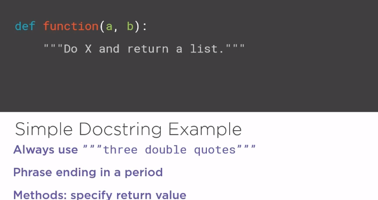
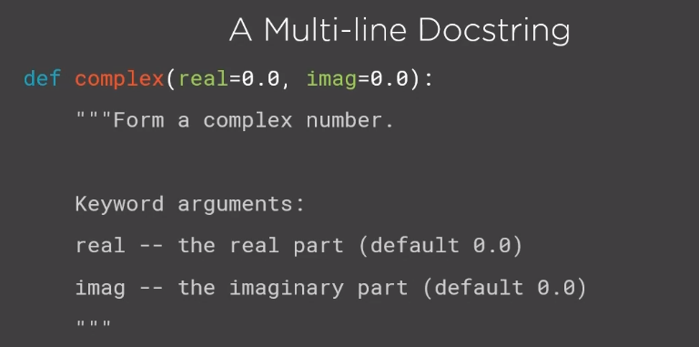
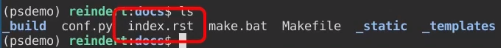
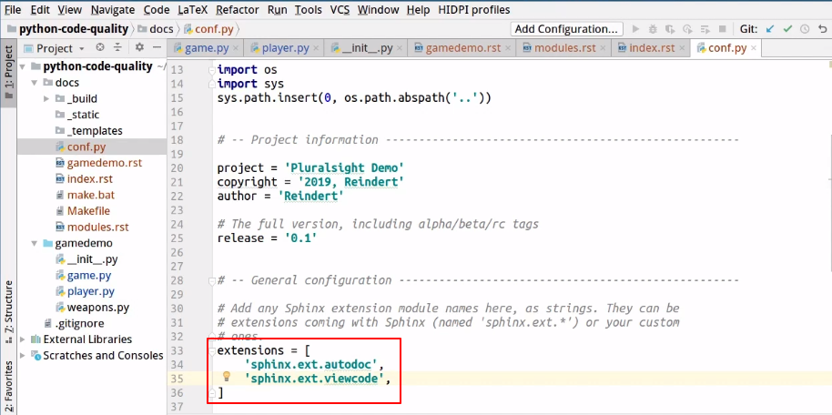
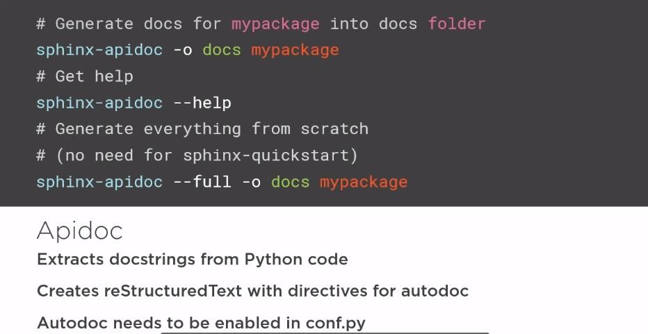
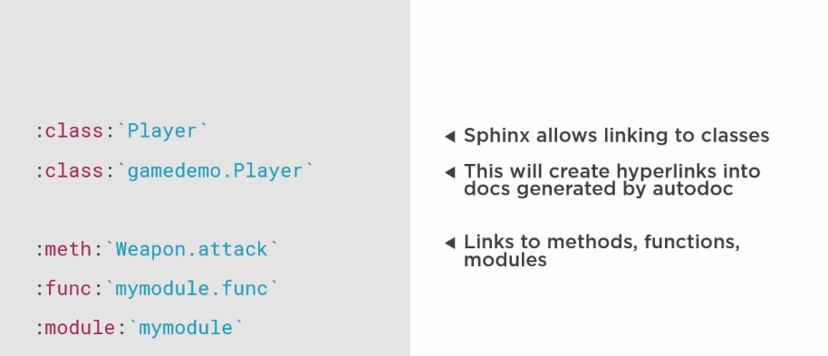
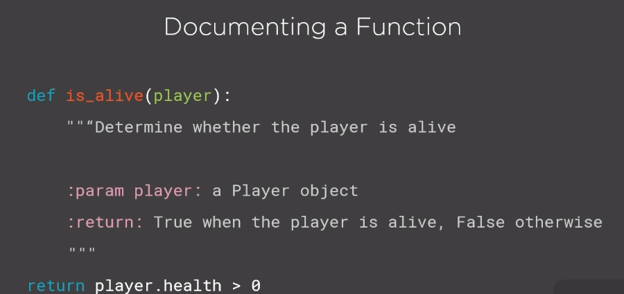

# how to generate the most document for project

* **Sphinx**: generating HTML from source documentation.
* **reStructuredText**: markup formatting

``following the rule of PEP257 for docstrings with semantics and conventions``

**Docstrings**:

* string as first statement of a module, function, class or method.
* Becomes the __doc__ attribute.
  * always use ```three double quotes```
  * phrase ending in a period.
  * Methods: specify return value.
  * 
  * 

## getting start with Sphinx

Sphinx advantage:

* Python documentation generator.
* De-facto standard.
* reStructuredText -> HTML, PDF, etc.
* Extract docstrings from code.

```python
# using pip install sphinx
>>> pip install sphinx
```


edit the index.rst (reStructuredText file).

* the paragraph was seperated by **blank lane**, section was determined by underline headers.
* the code section would be started two "::" and surrended by two blank lane.
* two dot is the comment "..".
* double check the manual of sphinx.

## applying type hint in a project

import the built-in function type:
```python
from typing import Any
# or
from typing import Dict, Tuple, Sequence
# or
from typing import Iterable

#for example

def foo(item: Any) -> int:
    # Typechecks; 'item' could be any type,
    # and that type might have a 'bar' method
    item.bar()
    ...

    from typing import Dict, Tuple, Sequence

ConnectionOptions = Dict[str, str]
Address = Tuple[str, int]
Server = Tuple[Address, ConnectionOptions]

def broadcast_message(message: str, servers: Sequence[Server]) -> None:
    ...

# The static type checker will treat the previous type signature as
# being exactly equivalent to this one.
def broadcast_message(
        message: str,
        servers: Sequence[Tuple[Tuple[str, int], Dict[str, str]]]) -> None:
    ...
```
please refer this [link](https://docs.python.org/3/library/typing.html) for further details.

## Apidoc (Sphinx extension, generate docs from python source)

at the first line, please include a docstring with tittle like:

```python
"""
    game.py
    -----------

    this module contains........
"""

class Game:
    """
    The Game class implements the game mechaines for demo, read the documentation for the :meth:'run' method.
    """
        def  __init__(self, player1, player2):
            """
            Creat a new game with two players.

            :param player1: First player
            :param player2: second player
            """
            self.p1 = player1
            self.p2 = player2
```

the useage of " :meth:'run' " in the docstring is **reStructuretext**, and using pycharm can help to generate those docstring automaticly.

Next step is to  generate the documentation (in HTML or other type) for the python code using Sphinx (any other module that use **reStructuretext**.)

```bash
sphinx-apidoc -o docs packagename/
```

the output would generate two ***.rst*** file. you can include it in the conf.py and then using sphinx to get the html documentation.

in the conf.py, it's better to add sphinx extensions:


then  rerun the make:

```bash
make clean html
```

### the last of the last !

you can **publish** the documentation in several way, like host this THML on your own web server. or using [readthedocs.org](https://readthedocs.org/) or [github pages](https://pages.github.com) to help you host it(connect your git).

## Summary

the use of **Sphinx**:



creat the link in your docstrings:



