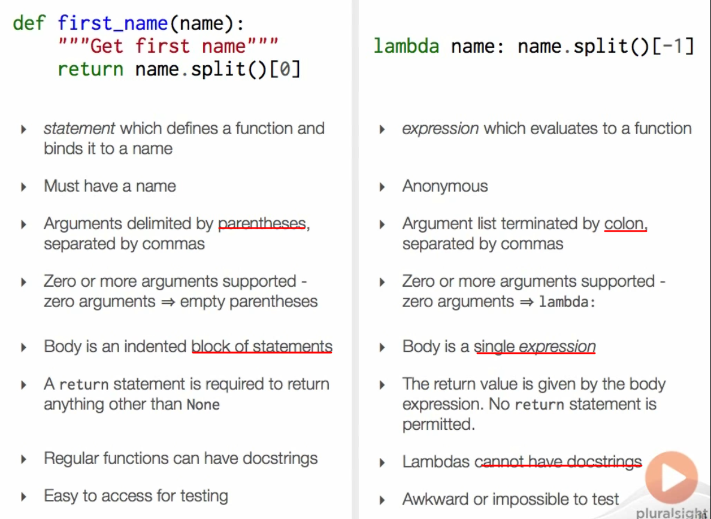

- [callable classes](#callable-classes)
- [Conditionals](#conditionals)
- [Lambdas](#lambdas)
- [Detecting callable objects](#detecting-callable-objects)
- [extended formal argument syntax](#extended-formal-argument-syntax)
 # "\_\_call_\_\" special method
在Python的class中有一些函数往往具有特殊的意义。__init__()和__call__()就是class很有用的两类特殊的函数。

## \_\_init__()
在Python中，**__init__()** 函数的意义等同于类的构造器（同理，**__del__()** 等同于类的析构函数）。因此，**__init__()** 方法的作用是创建一个类的实例。

## \_\_call__()
Python中的函数是一级对象。这意味着Python中的函数的引用可以作为输入传递到其他的函数/方法中，并在其中被执行。
而Python中类的实例（对象）可以被当做函数对待。也就是说，我们可以将它们作为输入传递到其他的函数/方法中并调用他们，正如我们调用一个正常的函数那样。而类中__call__()函数的意义正在于此。为了将一个类实例当做函数调用，我们需要在类中实现__call__()方法。也就是我们要在类中实现如下方法：def __call__(self, *args)。这个方法接受一定数量的变量作为输入。 
假设x是X类的一个实例。那么调用x.__call__(1,2)等同于调用x(1,2)。这个实例本身在这里相当于一个函数。

## 总结
那么，__init__()和__call__()的区别如下： 
1. __init__()的作用是初始化某个类的一个实例。 
2. __call__()的作用是使实例能够像函数一样被调用，同时不影响实例本身的生命周期（__call__()不影响一个实例的构造和析构）。但是__call__()可以用来改变实例的内部成员的值。
--------------------- 
作者：耀凯考前突击大师 
来源：CSDN 
原文：https://blog.csdn.net/Yaokai_AssultMaster/article/details/70256621 
版权声明：本文为博主原创文章，转载请附上博文链接！

# callable classes
the callable classes will always followed with "()", we can define the class as "Tuple" or "list"

# Conditionals

the **conditional expression** can be felxible, for example:
```python

if condition:
    result = true_value
else
    result = false_value

# the statement can also be written as:

result = true_value if condition else false_value

```

# Lambdas
lambdas will change the value to the **callable function**, need use "()" to use the new lambdas function.
for example:
```python
>>>last_name = lambda name: name.split()[-1]
>>>last_name
<function <lambda> at 0x01C00858>
```


# Detecting callable objects
objects that can be callable includes: **def fucntion**, **lambda**, **methods**, **calss objects**. **class object with duderable method**

for example:
```python
>>>def is_even(x):
...    return x%2 == 0
>>>callable(is_even)
True
>>>is_odd = lambda x:x%2 == 1
>>>callable(is_odd)
True
>>>callable(list)
True
>>>callable(list.append)
True
>>>class callme:
...    def __call__(self):
...        print("Call me")
>>>call_me = callme()
>>>callable(call_me)
True
```

# extended formal argument syntax
the use of *args means the input is necessary in the def function:
```python
>>>def hypervolume(*args):
...    print(args)
...    print(type(args))
...
>>> hypervolume(3, 4)
(3, 4)
<class 'tuple'>
```
when you need the parameter in the fucntion, considering using the required parameters arguments, the *arg:
```python
>>>def hypervolume(length, *length):
```
the * length means there must be one argument in the fuction when you trying to call it.

**kwargs** will let the fuction accept the varitent, and give it a tag. the tag can be **callable** in the fuction.
for example:
```python
>>> def tag(name, **kwargs):
...     print(name)
...     print(kwargs)  
...     print(type(kwargs))
...
>>> tag('img', src= "monet.jpg", alt = "asdfqerr", border = 1)
img
{'src': 'monet.jpg', 'alt': 'asdfqerr', 'border': 1}
<class 'dict'>
```
the argument is existed in dictionary and can be called using dictionary method:
```python
>>> def tag(name, **attributes):
...     result = '<' + name 
...     for key, value in attributes.items():
...             result += ' {k} = "{v}"'.format(k = key, v = str(value))
...     result += '>'
...     return result
... 
>>> tag('img', scr = "hahahaha", alt = "fdadfadsf", border = 1) 
''
```
the **extended formal argument syntax** can be apply equally to retular functions, lambda, and other callables.
