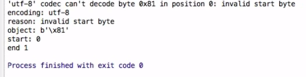
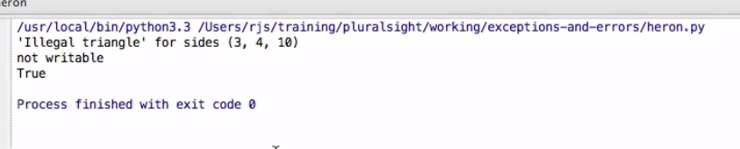

# error and exception
## exception payloads
the use of error message calling could be helpful for the debugging, for example:
```python
def main():
    try:
        b'x81'.decode('utf-8')
    except UnicodeError as e:
        print(e)
        print('encoding:', e.encoding)
        print("reason:", e.reason)
        print("object:", e.object)
        print("start:", e.start)
        print("end:", e.end)
if __name__ = '__main__':
    main()
```
if the x81 can't be decode by UTF-8, more error message would be showed:


#
## defining a new exception

for example:

**how to use the [property_decoration](./@property的使用方法.md) to avoid the value change**

```python
import math
class TrangleError (Exception):
#the class(Exception) will inherits __init__, __str__, __repr__
    def __init__(self, text, sides):
        super().__init__(text)
        self._sides = tuple(sides) #readonly attribute

    @property
    def sides(self):
        return self._sides
    def __str__(self):
        return "'{}' for sides {}".format(self.arg[0], self._sides)
    def __repr__(self):
        return "TraingleError({!r}, {!r}".format(self.arg[0], self._sides)

def triangle_area(a, b, c):
    side = sorted((a,b,c))
    if side[2]  > side[0] + side[1]:
        raise TrangleError("Illegal Traingle", sides)
    p = (a+b+c)/2
    a = math.sqrt(p*(p-a)*(p-b)*(p-c))
    return a
```
#
## Chaining Exceptions
 
### implicit chaining exception
for example there is another error added in the previous one, and the implicit chaining **was associated with \_\_context\_\_**. 

```python
import math
class TrangleError (Exception):
#the class(Exception) will inherits __init__, __str__, __repr__
    def __init__(self, text, sides):
        super().__init__(text)
        self._sides = tuple(sides) #readonly attribute

    @property
    def sides(self):
        return self._sides
    def __str__(self):
        return "'{}' for sides {}".format(self.arg[0], self._sides)
    def __repr__(self):
        return "TraingleError({!r}, {!r}".format(self.arg[0], self._sides)

def triangle_area(a, b, c):
    side = sorted((a,b,c))
    if side[2]  > side[0] + side[1]:
        raise TrangleError("Illegal Traingle", sides)
    p = (a+b+c)/2
    a = math.sqrt(p*(p-a)*(p-b)*(p-c))
    return a

def  main():
    try:
        a = triangle_area(3,4,10)
        print(a)
    except TrangleError as e:
        try:
            print (e, file = sys.stdin)
        except io.UnsupportedOperation  as f:
            print(e)
            print(f)
            print(f.__context__ is e)
```
here is the result:



### explicit chaining exceptions
usually tranlating the exception from one to another, and explicit chaining **was associated with \_\_cause\_\_**, for example:
```python
import math

Class InclinationError(Exception):
    pass

def inclination(dx, dy):
    try:
        return math.degrees(math.atan(dy/dx))
    except ZeroDivisionError  as e:
        raise InclinationError("Slope can not be vertical") from e

try:
    inclination(0, 5)
except InclinationError as e:
    print(e)
    print(e.__cause__)

>>>"Slope can not be vertical"
>>>"division by zero"
```
#
## Tracebacks

