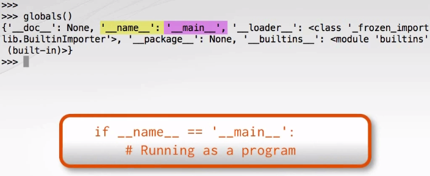

# Introspection
## Object type in depth
the type is the dunder-class "type", for example:
```python
>>> i = 7
>>> type(i) 
<class 'int'>
>>> i.__class__
<class 'int'>
>>> i.__class__.__class__
<class 'type'>
```

instead of using the type testing the value, we prefer to use **isinstance** or **issubcluss**, otherwise we might get the wrong subclass information ([please check this out](https://www.runoob.com/python/python-func-isinstance.html))
>isinstance() 与 type() 区别：
>type() 不会认为子类是一种父类类型，不考虑继承关系。
>isinstance() 会认为子类是一种父类类型，考虑继承关系。 
>如果要判断两个类型是否相同推荐使用 isinstance()。
---
## introspecting objects
using the function **getattr** to check if the value have some type of attr, for example:
```python
i = 7
>>> getattr(i, 'denomiator')
1
>>>  i.denominator
1
>>> getattr(i, 'conjugate') 
<built-in method conjugate of int object at 0x641AE810>
>>> callable(getattr(i, 'conjugate')) 
True
>>> i.conjugate.__class__.__name__
'builtin_function_or_method'
# if the attr not exist, for example:
>>> getattr(i, 'index') 
Traceback (most recent call last):
  File "<stdin>", line 1, in <module>
AttributeError: 'int' object has no attribute 'index'
#or use another function to call back TURE/FALSE
>>> hasattr(i, 'index') 
False
```
  `there is another way to call the **attibuteError**, using try/except and include the AttributeError in the except condition and python will run faster than checking the attribute first (use hasattr).`

## introspecting scopes

two build-in function to examiate scopes, first function is **globals()**:

```python
>>> globals()
{'__name__': '__main__', '__doc__': None, '__package__': None, '__loader__': <class '_frozen_importlib.BuiltinImporter'>, '__spec__': None, '__annotations__': {}, '__builtins__': <module 'builtins' (built-in)>, 'i': 7}
>>> a = 42
>>> globals()
{'__name__': '__main__', '__doc__': None, '__package__': None, '__loader__': <class '_frozen_importlib.BuiltinImporter'>, '__spec__': None, '__annotations__': {}, '__builtins__': <module 'builtins' (built-in)>, 'i': 7, 'a': 42}
>>> globals()['tau'] = 123456789
>>> tau
123456789
```
another one is **locals()**, check the code for details:

```python
def report_scope(arg):
    from pprint import pprint as pp
    x = 496
    pp(locals(), width = 10)

>>> x = 123
>>> report_scope(42)
{'arg': 42,
 'pp': <function pprint at 0x0300E340>,
 'x': 496}
#locals() also could be used to pass dictionary variables in to format strings
>>> name = "jerry"
>>> age = "28" 
>>> country = "China"
>>> "{name} is {age} years old and is from {country}".format(**locals()) 
'jerry is 28 years old and is from China'
```
## the Python Standard library inspect module
when inspect a module there is a way to filter what you are looking for:
.png)
```python
import inspect
import sorted_set

>>>inspect.ismodule(sorted_set)
True
>>>inspect.getmembers(sorted_set, inspect.isclass)
```

inspect模块主要提供了四种用处：

(1). 对是否是模块，框架，函数等进行类型检查。

(2). 获取源码

(3). 获取类或函数的参数的信息

(4). 解析堆栈

不使用模块inspect，仅使用内置函数，也能实现自省和反射的功能。
自省意味着获取对象的属性和方法；反射通过字符串映射的方式获取或者修改对象的方法或者属性（比如以某个属性的名字字符串作为参数传入某个函数），是自省的一种具体实现方法。
python中相关功能的内置函数如下：
```python
dir(obj)->将对象的所有属性、方法以列表形式返回
hasattr(obj,name_str)->判断objec是否有name_str这个方法或者属性
getattr(obj,name_str)->获取object对象中与name_str同名的方法或者函数
setattr(obj,name_str,value)->为object对象设置一个以name_str为名的value方法或者属性
delattr(obj,name_str)->删除object对象中的name_str方法或者属性
```
但是使用inspect.getmembers(obj)这个方法能够获取到更详尽的自省信息，且可读性更佳，下面将其和dir内置函数进行比较：
```python
import inspect
#示例对象--某个函数
def foo(a: int, b: str) -> int:
    return a + int(b)
    
dir(foo)
-->['__annotations__', '__call__', '__class__',...]

inspect.getmembers(foo)
-->[
('__annotations__', {'a': <class 'int'>, 'b': <class 'str'>, 'return': <class 'int'>}),
('__call__', <method-wrapper '__call__' of function object at 0x032C7B70>), 
('__class__', <class 'function'>),
...]
```
可以看到使用dir()仅仅获得一个字符串列表，而使用inspect.getmembers()可以获得每个属性的类型信息。

### 更高的类型检查
我们知道可以使用type(),isinstance()等内置函数进行类型检查，常用于基本数据类型或者对象实例的class判别，比如:
```python
type(1)==int #比较数据类型
isinstance(cat,Cat) #比较对象实例是否属于某个类
```
但如果要进行更"元"一点的类型比较呢？比如判断一个对象是否为一个模组，一个内置函数，一个生成器，甚至一个 await 表达式：
```python
>>> import inspect
>>> inspect.ismodule(inspect)    # 检查 inspect 是否为模组
True
>>> inspect.ismethod(inspect)    # 检查 inspect 是否为对象方法
False
>>> inspect.isfunction(len)      # 检查 len 是否为函数
True
>>> inspect.isbuiltin(len)       # 检查 len 是否为内置函数
True
>>> inspect.isgenerator(inspect) # 检查 inspect 是否为生成器
False
>>> inspect.isawaitable(inspect) # 检查 inspect 是否可用于 await 表达式
False
>>>
```
因此，使用inspect.isXXX 方法可以进行更高级的类型判断。
### 操作函数参数签名
python3中新增了函数注解：
```python
def foobar(a: int, b: "it's b", c: str = 5) -> tuple:
    return a, b, c
```
python原生有__annotations__属性用于获取函数注解：
```python
>>> foobar.__annotations__
{'a': int, 'b': "it's b", 'c': str, 'return': tuple}
```
使用inspect模块同样可用获取到函数（callable）的参数信息。

* inspect.signature 获取到函数参数的对象Signature，包括两个常用参数:
    * Signature.parameters 参数值的名字和类型
    * Signature.return_annotation 返回值类型

```python
>>> def foo(name, a: int, b: float):
...  pass
... 
>>> sig = inspect.signature(foo)
>>> sig
<Signature (name, a:int, b:float)>
>>> str(sig)
'(name, a:int, b:float)'
>>> sig.parameters
OrderedDict([('name', <Parameter "name">), ('a', <Parameter "a:int">), ('b', <Parameter "b:float">)])

```
* Signature.bind 将具体参数绑定到对象Signature上,获得BoundArguments对象（保存了参数信息）
```python
>>> args = ('foobar', 10)
>>> kwargs = {'b': 23.4}
>>> bound = sig.bind(*args, **kwargs)   # bind args to signature parameters
>>> bound
<BoundArguments (name='foobar', a=10, b=23.4)>
>>> bound.arguments['name']
'foobar'
>>> bound.arguments['a']
10
>>> bound.arguments['b']
23.4
```
综上，使用inspect可以将函数形参和实参封装为对象，对进一步操作具有意义。

### 受到钦定的类型检查实现
使用inspect获取到参数对象后，结合函数注解属性__annotations__，可以写一个很优雅的强制类型检查装饰器。
```python
from functools import wraps
def checked(func):
    ann=func.__annotations__
    sig=inspect.signature(func)
    @wraps(func)
    def wrapper(*args,**kwargs):
        bound=sig.bind(*args,**kwargs)
        for k,v in bound.arguments.items():
            if k in ann:
                assert isinstance(v,ann[k]),f'Type Error Expected {ann[k]}'
        return func(*args,**kwargs)
    return wrapper

>>> @checked
... def add(a: int, b: int) -> int:
...     while b:
...         a, b = b, a % b
...     return a
>>> add(2.7, 3.6)
Traceback (most recent call last):
  AssertionError: Type Error Expected <class 'int'>
>>> add(27, 36)
9
```
PS: [wraps decorator 的作用](https://blog.csdn.net/hqzxsc2006/article/details/50337865)
综上，没有额外在装饰器参数中指明所需要检查类型，直接利用python自省的特性和inspect获取到函数的参数和类型要求，完成强制类型检查。
