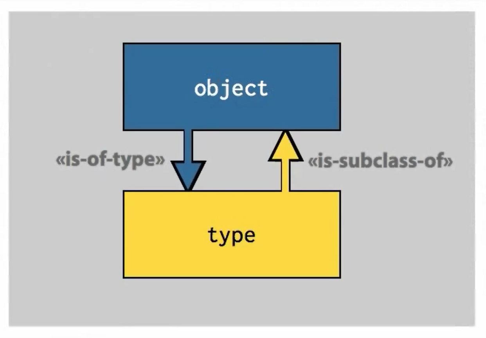

# Introspection
## Object type in depth
the type is the dunder-class "type", for example:
```python
>>> i = 7
>>> type(i) 
<class 'int'>
>>> i.__class__
<class 'int'>
>>> i.__class__.__class__
<class 'type'>
```

instead of using the type testing the value, we prefer to use **isinstance** or **issubcluss**, otherwise we might get the wrong subclass information ([please check this out](https://www.runoob.com/python/python-func-isinstance.html))
>isinstance() 与 type() 区别：
>type() 不会认为子类是一种父类类型，不考虑继承关系。
>isinstance() 会认为子类是一种父类类型，考虑继承关系。 
>如果要判断两个类型是否相同推荐使用 isinstance()。
---
## introspecting objects
using `print()` 