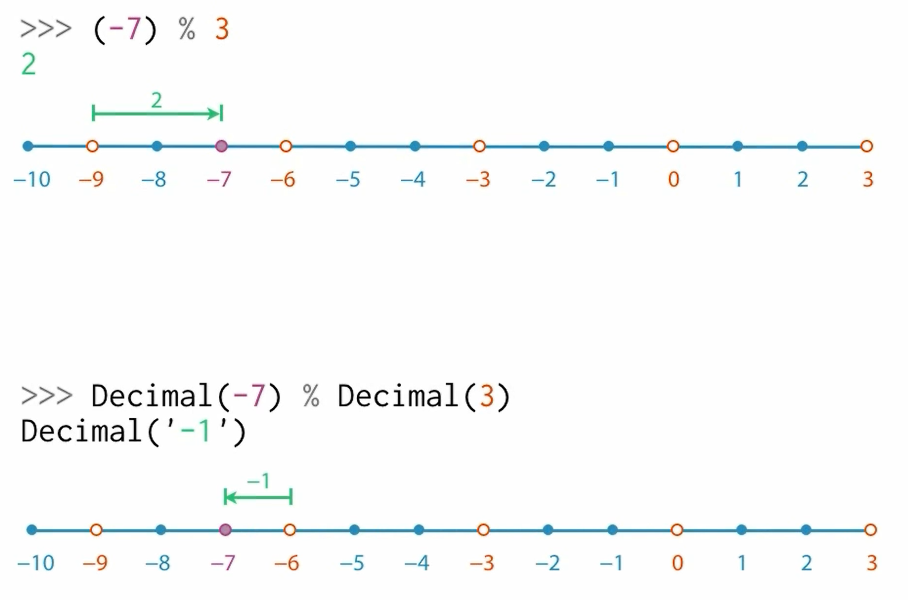
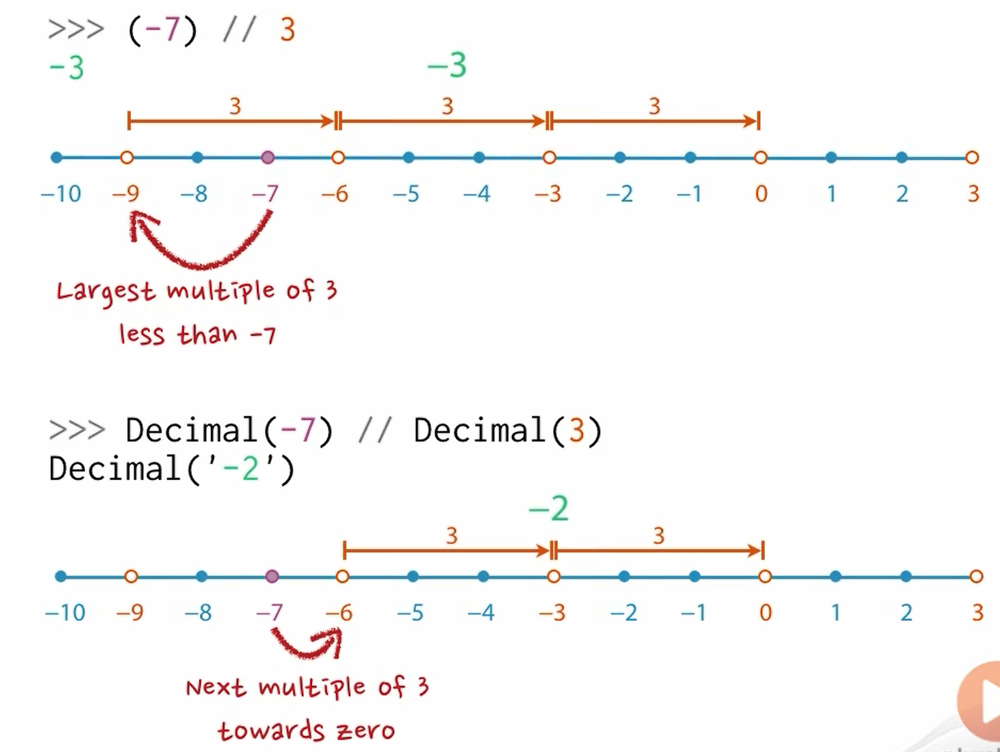
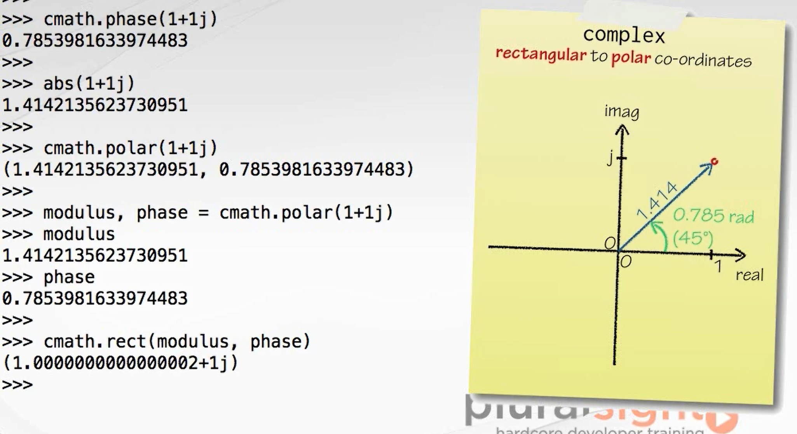
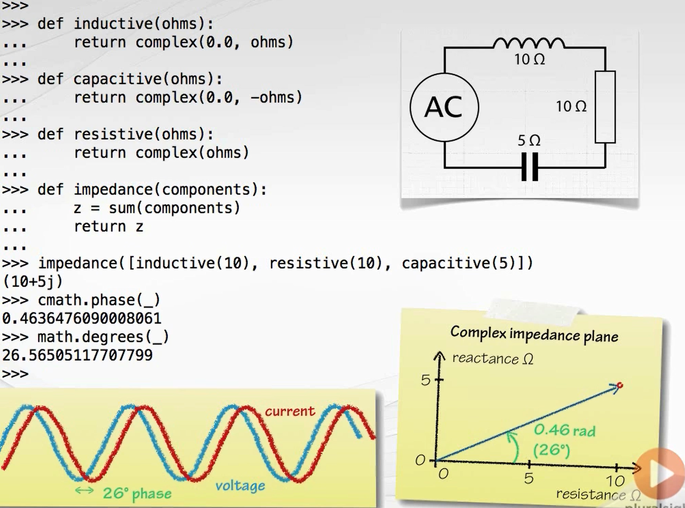
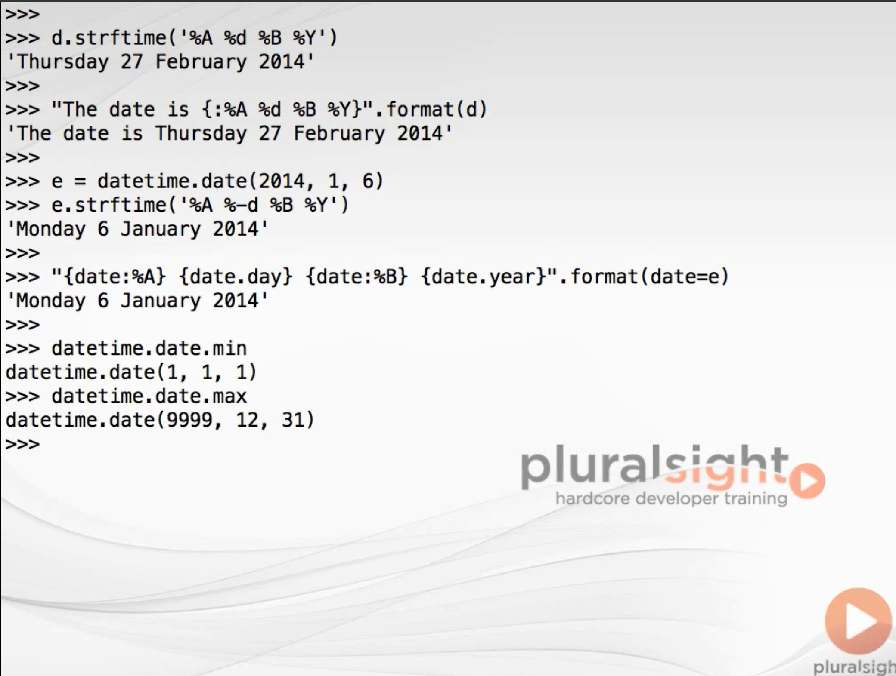

- [Reviewing int and float](#reviewing-int-and-float)
  - [the decimal module and the decimal type](#the-decimal-module-and-the-decimal-type)
  - [the fraction module and the Fraction class](#the-fraction-module-and-the-fraction-class)
  - [another numerical type: complex](#another-numerical-type-complex)
  - [built-in numeric function abs()](#built-in-numeric-function-abs)
  - [datetime module](#datetime-module)
# Reviewing int and float
the different among:
int, float 

the float info can be loaded through sys, for example:
```python
import sys
>>>sys.float_info
sys.float_info(max=1.7976931348623157e+308, max_exp=1024, max_10_exp=308, min=2.2250738585072014e-308, min_exp=-1021, min_10_exp=-307, dig=15, mant_dig=53, epsilon=2.220446049250313e-16, radix=2, rounds=1)
```
## the decimal module and the decimal type
the standard library module with lower case "d", which contain the class with upper case "D".
using the decimal instead of the float can avoid hard cases and debug edge cases. 
```python
import decimal
>>> decimal.getcontext()
Context(prec=28, rounding=ROUND_HALF_EVEN, Emin=-999999, Emax=999999, capitals=1, clamp=0, flags=[], traps=[InvalidOperation, DivisionByZero, Overflow])
# the prec shows that the decimal can configured with 28 places of decimal
from decimal import Decimal
>>> Decimal()
Decimal('0')
>>> Decimal(5) 
Decimal('5')
# the Decimal class also take string
>>> Decimal("2") 
Decimal('2')
>>> Decimal('0.8')-Decimal('0.7') 
Decimal('0.1')
# if it is not string, the decimal will take it into the 28 position
>>> Decimal(0.8)-Decimal(0.7) 
Decimal('0.1000000000000000888178419700')
```
the dicimal module also have a different output when using "%":


when using the "//", the result is the same:


## the fraction module and the Fraction class
```python
from fractions import Fraction
>>> x = Fraction(2,3)
>>> x
Fraction(2, 3)
>>> Fraction(0.5) 
Fraction(1, 2)
>>> Fraction(0.1) 
Fraction(3602879701896397, 36028797018963968)
# Fraction also take string value
>>> Fraction(Decimal('0.1')) 
Fraction(1, 10)
>>> Fraction('0.1')          
Fraction(1, 10)
```

## another numerical type: complex

this is a built-in type and no need to import, each complex imcluding a **real part**, and an **imaginary part**, for example:
```python
#the imaginary part always use j as the syntax surrfix
>>> 2j
2j
>>> 1x
  File "<stdin>", line 1
    1x
     ^
SyntaxError: invalid syntax
>>> type(2j) 
<class 'complex'>
>>> 3+4j
(3+4j)
>>> c = 3+5j
>>> c.real
3.0
>>> c.imag
5.0
>>> c.conjugate()
(3-5j)
# the cmath module can calculate the complex calculation
import cmath
>>> cmath.sqrt(-1) 
1j
# cmath also can transfer rectanglar to polar co-ordinates
>>> cmath.phase(1+1j)
0.7853981633974483
>>> abs(1+1j) 
1.4142135623730951
>>> cmath.polar(1+1j) 
(1.4142135623730951, 0.7853981633974483)
```

 
the complex also can be used to numerical a diagram:


## built-in numeric function abs()
this function can give the distance from "0"

## datetime module

how to string format the time:
```python
d.strftime('')
```
