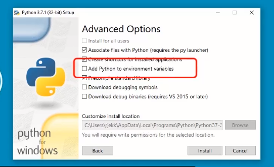
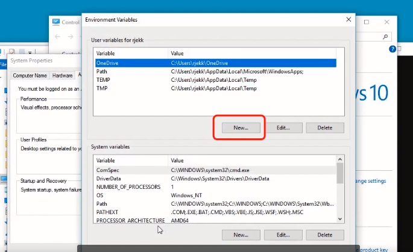
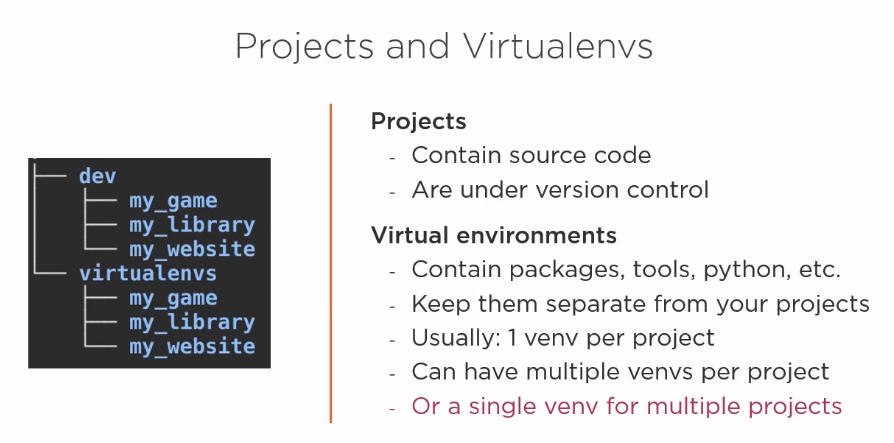
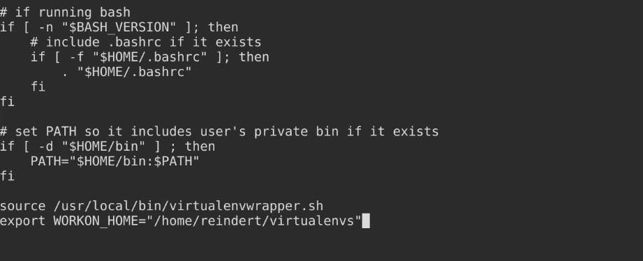
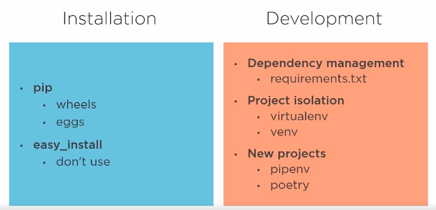
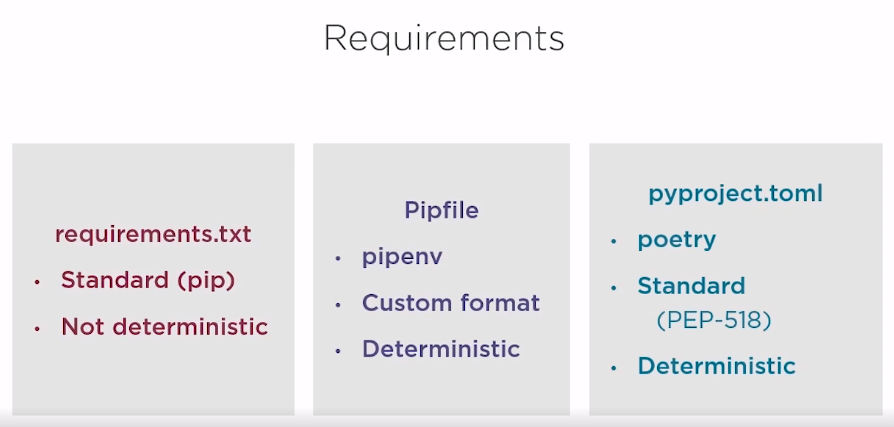

# pip install packages

Overview in this chapter:

* Dependencies
* packages
  * Find, download and install
  * Manage
* Virtual environments
  * Project dependencies
  * creat use, and manage
* Best practices
* Recommended tools

## pip-package management

```python
pip -v
#will show the version of the python
```

when using the Windows:

* Configuring PATH
* Run pip





### Managing packages with pip

* Installing packages
* Removing packages
* Listing packages
* Inspecting packages
* Getting help
* Searching Packages

* Rule #1:
  * best practice with a virtual environment (to avoid any fatal error)
  * don't use pip with sudo

```python
# check the package list
pip list
# install package
pip install packagename
# removing package
pip unistall packagename
# looking for help
pip help list
# for package detail
pip show packagename
```

check the **[pypi](https://pypi.org/)** for more package :D

### where are packages installed

* the sys.path variable
* installing for other python version

```python
>>> import sys
>>> sys.path
['', 'C:\\Users\\Jerry\\AppData\\Local\\Programs\\Python\\Python38-32\\python38.zip', 'C:\\Users\\Jerry\\AppData\\Local\\Programs\\Python\\Python38-32\\DLLs', 'C:\\Users\\Jerry\\AppData\\Local\\Programs\\Python\\Python38-32\\lib', 'C:\\Users\\Jerry\\AppData\\Local\\Programs\\Python\\Python38-32', 'C:\\Users\\Jerry\\AppData\\Roaming\\Python\\Python38\\site-packages', 'C:\\Users\\Jerry\\AppData\\Local\\Programs\\Python\\Python38-32\\lib\\site-packages']
>>>
```

The package only can be ran under the right python version and location. (espicially when there are multiple version in the directory)

### a better way to call pip

```python
python2 -m pip install flask
#instead of just using pip
```

``it's all depend on the system configure!!``

## Virtual environments-Projects and dependencies

when on multiple project with confilctin dependencies, conflicts with system dependencies, multi-user systems, testing code against different python and library versions.

the env could isolate context package and remember:

* always work inside a virtual env.
* creat a virtual env for every project.

### install the env

```python
# install the env
python -m pip install virtualenv
#run the env
virtualenv projectname
#using typical python version
virtualenv -p python3 projectname
```

### activate the env

```powershell
# activate the env (in the project env folder)
activate.bat
# the new package would be installed in the env folder
pip list
```

### how to sync the package among the team

```bash
# creat requirement file
python -m pip freeze > requirement.txt
# install the requirement
python -m pip install -r requirement.txt
```



`the using of vox can help to test package under different version of Python`

## Virtualenvwrapper-making venv more convenient

for linux and mac:

```bash
sudo pip install virtualenvwrapper
which virtualenvwrapper.sh
#this should be in the default folder
#add this path in profile
```

edit the profile:


```bash
workon
# will list the env
workon env_name
# will activate the env
```

for windows user:

```powershell
pip install virtualenvwrapper-win
#no extra setup needed
#Default location for envs: %USERPROFILE%\Envs
```

## Other tools

* the Python packaging authority
  * here is the [link](Http://pypa.io)

* anaconda: [link](http://www.anaconda.com)
  * python distribution
  * package manager
  * instsaller
  * env tool
  * aimed at Data Science



* pipenv (more popular)
* poetry (better UI, supports packing)