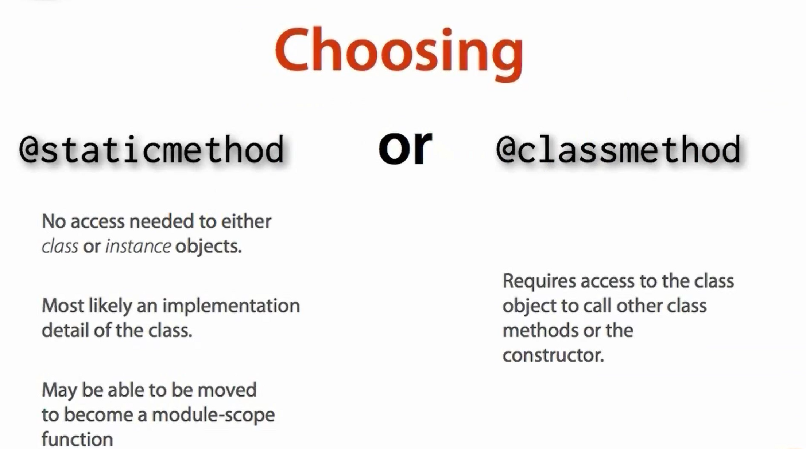
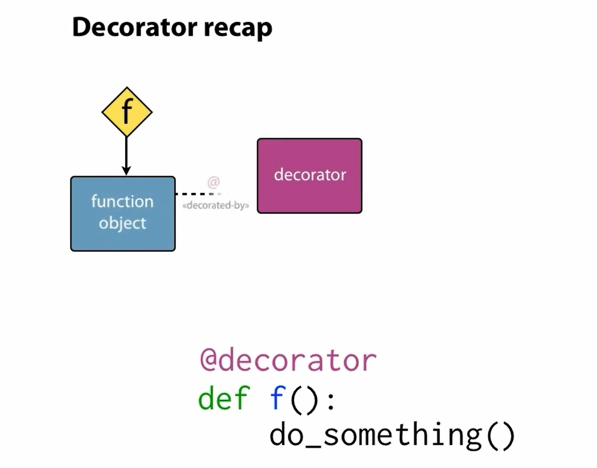
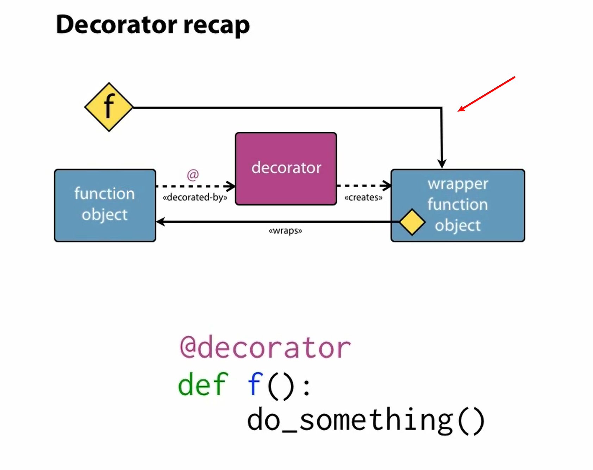

# class attributes and instance attributes

the class attibutes need get a full name if you want to call in in the method, for example:

please remember always use the instance attribute:

when the **new object was assigned to the class**, the serial number will plus 1 :D

# static method: using the @staticmethod decorator
when using the static method, no need to add the "self" and need to call the class to use the static method, for example:
```python
class shipping_container:  
    next_serial = 1337
    @staticmethod
    def get_next_serial():
        result = shipping_container.next_serial
        shipping_container.next_serial += 1
        return result
    def __init__(self, owner_code, contents):
        self.owner_code = owner_code
        self.contents = contents
        self.serial = shipping_container.get_next_serial()
```
once the static method was called, the value would be changed and even if the class has the static method was assigned to a new attibute, for example:
```python
# introduce a new class
class shipping_container_3:  
    next_serial = 1337
    def get_next_serial(self):
        self.result = shipping_container_3.next_serial
        shipping_container_3.next_serial += 1
        return self.result
    def __init__(self, owner_code, contents):
        self.owner_code = owner_code
        self.contents = contents
        "use the static method from shipping_container"
        self.serial = shipping_container.get_next_serial()

>>> c6 = shipping_container("YML", "coffee")
>>> c7 = shipping_container_3("QWE", "water")
>>> c6.serial
1337
>>> c7.serial
1338
>>> c6.next_serial
1339
>>> c7.next_serial
1337
>>> c7.get_next_serial
<bound method shipping_container_3.get_next_serial of <__main__.shipping_container_3 object at 0x03740CB0>>
>>> c7.get_next_serial()
1337
>>> c7.get_next_serial()
1338
>>> c7.result
1338
>>> c6.result
Traceback (most recent call last):
  File "<stdin>", line 1, in <module>
AttributeError: 'shipping_container' object has no attribute 'result'
```
c6's static method do not provide attribute result, and any of other class can call class shipping_containner's static method and change it's closuring value:D

```python
>>> c5 = shipping_container("SAD", "jaw")  
>>> c5.next_serial
1340
>>> c6.next_serial 
1340
>>> c7.next_serial
1339
```
# class methods

the difference between the class methods and staticmethod:



the class methods decorator example:
```python
class shipping_container:  
    next_serial = 1337
    @classmethod
    def get_next_serial(cls):
        result = cls.next_serial
        cld.next_serial += 1
        return result
    def __init__(self, owner_code, contents):
        self.owner_code = owner_code
        self.contents = contents
        self.serial = shipping_container.get_next_serial()
```

please check this paper for further details:
[static method and class method](https://www.zhihu.com/question/20021164)

# properties
the encapsulation using the @property dsecorator, and the decorator are the basic property system of python. 



then if the decorator was assigned to the function, what's happening next?


the function will be reassigned to the wrapper function object

the properties in the class only have the getter attribute and the only way to change it is to set up a setter method (known as the **@XXXX.setter**):

for example:
```python
class Example:
    @property
    def p(self):
        return self._p
    @p.setter
    def p(self, value):
        self._p = value
```
the property decorator can be inheritance using "super()"
and the setter need use the full length class name， for example:
```python
@class_A_name.property_getter_method.setter
```
here is something new book:
**design pattern-elements of reusable object-oriented software**
writen by Eric gamma

