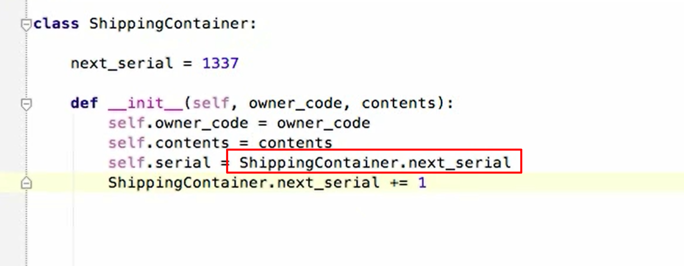

# class attributes and instance attributes

the class attibutes need get a full name if you want to call in in the method, for example:

please remember always use the instance attribute:

when the **new object was assigned to the class**, the serial number will plus 1 :D

# static method: using the @staticmethod decorator
