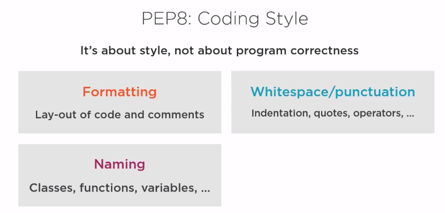

# PEP8 and PYLINT
## what is PEP?
Python Enhancement Proposal (PEP) 

here is the link to [PEP](https://www.python.org/dev/peps/)

## what is the PEP8?
mainly describe the style of the Python code

## PEP8 coding stype
it's about stype, not about program correctness (formatting, whitespace/punctuation, naming)

prefer this site: [PEP.org](https://pep8.org/)

pycharm have the build-in function to correct the format style