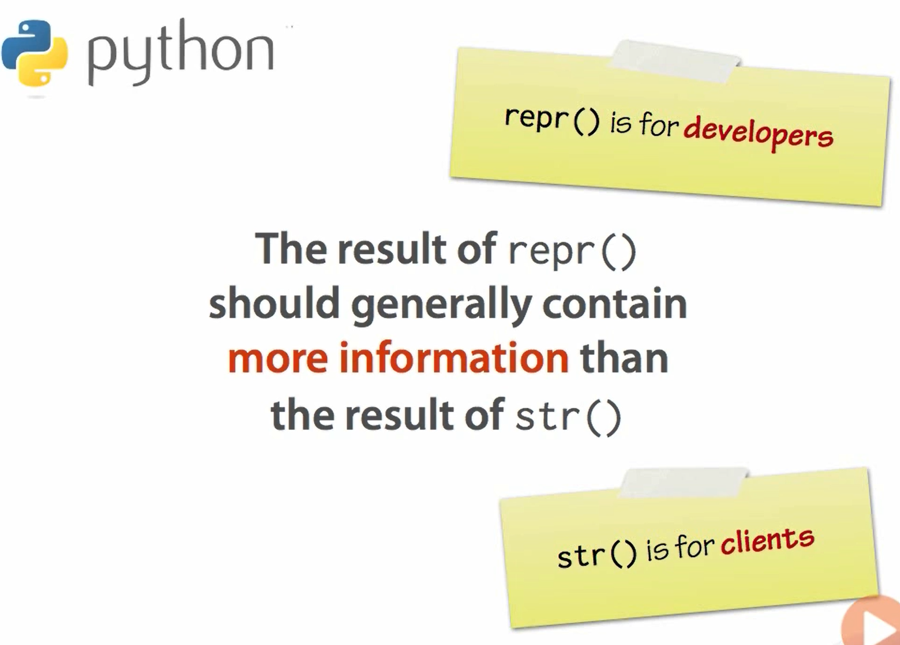
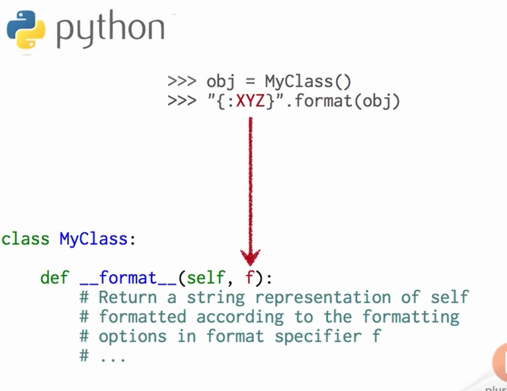
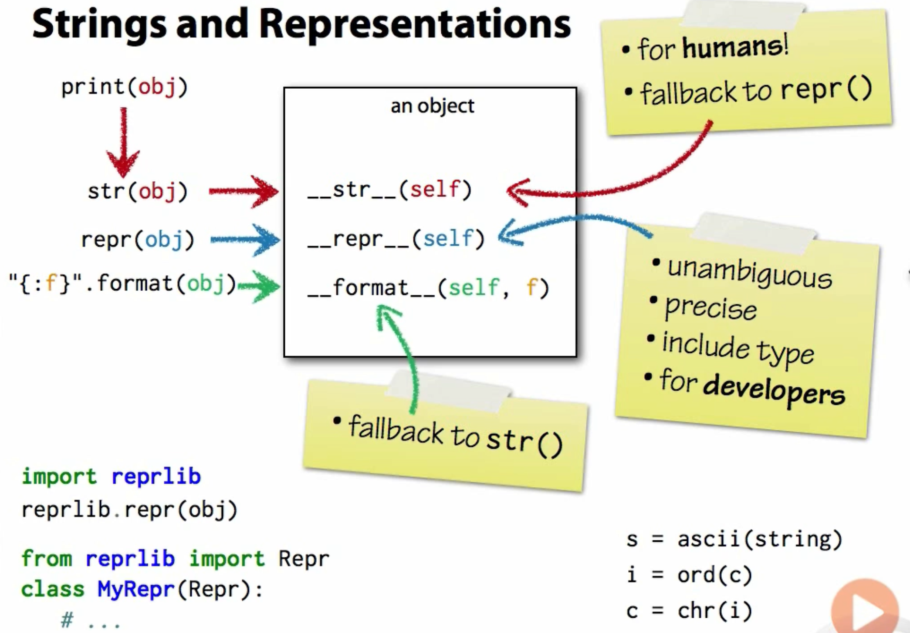

# content

- [content](#content)
- [two string representations](#two-string-representations)
  - [the built-in function repr()](#the-built-in-function-repr)
  - [the built-in function str()](#the-built-in-function-str)
  - [when are the representations used?](#when-are-the-representations-used)
  - [interaction with format()](#interaction-with-format)
  - [reprlib: the standard library module](#reprlib-the-standard-library-module)
  - [the built-in function ascii(), ord(), chr()](#the-built-in-function-ascii-ord-chr)
- [Summary](#summary)


# two string representations
two functions can take strings:
```python
str()
#and 
repr()
```
this two function reply on the sepcial method "\_\_str\_\_()" and "\_\_repr\_\_()"  to generate the string

## the built-in function repr()
the repr() can produce an unambiguous string representation of an object.

what is the different between str and repr?



please remember always write a repr for the class!! the default can be overwrite using the "\_\_repr\_\_()", since the default one do not contain anything important. for example:

```python
class point2D:
    def __init__(self,x,y):
        self.x = x
        self.y = y
    def __str__(self):
        return '({}, {})'.format(self.x, self.y)
    def __repr__(self):
        return 'Point2D(x={}, y={})'.format(self.x, self.y)
```
if using the repr you will see the details:
```python
>>> p = point2D(3,4)  
>>> repr(p) 
'Point2D(x=3, y=4)'

# if using the default repr()
>>> repr(p)         
'<__main__.point2D object at 0x00BC0C30>'
```

## the built-in function str()
produce a readable, human-friendly representation of an object, this is user oriented not programer oriented.

## when are the representations used?
print only used the str representation, for example:
```python
>>> str(point2D(3,4)) 
'(3, 4)'
>>> repr(point2D(3,4)) 
'Point2D(x=3, y=4)'
>>> print((point2D(3,4))) 
(3, 4)
```
By default, the str() simply called repr(), for example:
```python
class point2D:
    def __init__(self,x,y):
        self.x = x
        self.y = y
    #def __str__(self):
    #    return '({}, {})'.format(self.x, self.y)
    def __repr__(self):
        return 'Point2D(x={}, y={})'.format(self.x, self.y)

# thy this
>>> str(point2D(3,4)) 
'Point2D(x=3, y=4)'
```
the default str just called the repr() and usually need use "\_\_str\_\_()" to change the result that need to be showed to **user** oriented.

\***so the repr() is used when showing the elements of a colletion!**

## interaction with format()
as you can see the format was used when call "{}" in the "\_\_str\_\_()" and the "\_\_repr\_\_". the reality is more complicated than that:
```python
#there is a special method as __str__() and __repr__()
__format__()

#for example:
class point2D:
    def __init__(self,x,y):
        self.x = x
        self.y = y
    def __str__(self):
        return '({}, {})'.format(self.x, self.y)
    def __repr__(self):
        return 'Point2D(x={}, y={})'.format(self.x, self.y)
    def __format__(self,f):
        return '[Formatted point: {}, {}, {}]'.format(self.x, self.y, f) 

# try this:
>>> 'this is the point: {}'.format(point2D(1,2)) 
'this is the point: [Formatted point: 1, 2, ]'
```
Question:
what exactly the "f" in \_\_format\_\_() means?


that contain any specify formatting option in the original format string.

for example:
```python
class point2D:
    def __init__(self,x,y):
        self.x = x
        self.y = y
    def __str__(self):
        return '({}, {})'.format(self.x, self.y)
    def __repr__(self):
        return 'Point2D(x={}, y={})'.format(self.x, self.y)
    def __format__(self,f):
        if f == 'r':
            return '{}, {}'.format(self.y, self.x)
        else:
            return '{}, {}'.format(self.x, self.y)
# try this
>>> '{}'.format(point2D(1,2)) 
'1, 2'
>>> '{:r}'.format(point2D(1,2)) 
'2, 1'
```

by default, the \_\_format\_\_() just calls \_\_str\_\_(), but the it can be forced to use \_\_repr\_\_() using , for example:
```python
# using !r force to use __repr__
>>> '{!r}'.format(point2D(1,2)) 
'Point2D(x=1, y=2)'
# using !s force to use __str__
>>> '{!s}'.format(point2D(1,2)) 
'(1, 2)'
```

## reprlib: the standard library module
support alternative implementations of repr(), this is can output limits otherwise excessive string length, this is the built-in function for the repr, for example:
```python
>>>import reprlib
>>>points = [point2D(x,y) for x in range(1000) for y in range(1000)]
>>> len(points) 
1000000
>>> reprlib.repr(points) 
'[Point2D(x=0, y=0), Point2D(x=0, y=1), Point2D(x=0, y=2), Point2D(x=0, y=3), Point2D(x=0, y=4), Point2D(x=0, y=5), ...]'
```

the default function reprlib is more that that:

.png)

## the built-in function ascii(), ord(), chr()
* the ascii() will transfer the unicode into ascii code.

* the ord() will converts a single character to its integer Unicode  codepoint.
* otherwise, the chr() will converts a integer unicode codepoint to a single character string.
for example:
```python
>>> chr(190) 
'¾'
>>> ord('¾') 
190
```

# Summary

here it is :D
