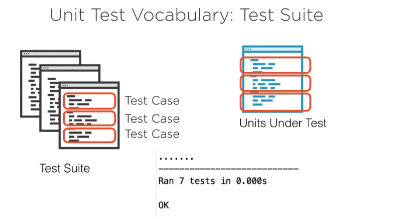
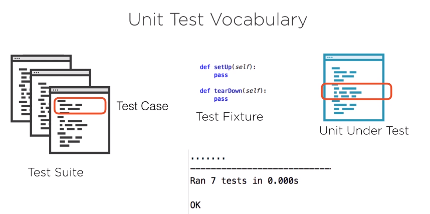

Content

- [unit testing fundamental](#unit-testing-fundamental)
  - [Unit Test Vocabulary](#unit-test-vocabulary)
  - [Summary](#summary)
- [Unit Testing Why and When](#unit-testing-why-and-when)
  - [understand what to build](#understand-what-to-build)
  - [document the unites](#document-the-unites)
  - [design the units](#design-the-units)
  - [regression protection](#regression-protection)
- [Unit Testing with pytest](#unit-testing-with-pytest)
- [Testable Documentation with doctest](#testable-documentation-with-doctest)
- [Using Test Doubles](#using-test-doubles)
- [Parameterized Tests & Test Coverage](#parameterized-tests--test-coverage)


# unit testing fundamental

it is a small Piece of code:
* a method or funciton
* a module or class
* a small group of related classes

automated unit test is designed by a human and run without intervention, reports either 'pass' or 'fail'.

```python
import unittest


class PhoneBook:

    def __init(self):
        self.numbers = {}

    def add(self, name, number):
        self.numbers[name] = number
        pass

    def lookup(self, name):
        return self.numbers[name]
    
    def is_consistent(self):
        return True 

class PhoneBookTest(unittest.TestCase):

    def setUp(self) -> None:
    '''automatically run before unittest'''
        self.phonebook = PhoneBook()

    def tearDown(self) -> None:
    '''automatically run after unittest, release resources from memory like files'''
        pass

    def test_lookup_by_name(self):
        self.phonebook.add("Bob", "12345")
        number = self.phonebook.lookup("Bob")
        self.asertEqual("12345", number)
    
    def test_missing_name(self):
        with self.assertRaises(KeyError):
            self.phonebook.lookup("missing")

    @unittest.skip("WIP") # will sikp next module
    def test_empty_phonebook_is_consistent(self):
        self.assertTrue(self.phonebook.is_consistent())
```

if you want to run the unittest using:(in the same folder)

```bash
python -m unittest
```

Using pycharm and it can add the unittest in IDE.(try this :D).

## Unit Test Vocabulary
* Test suite
* Test case
* Test Fixture
* Unit Under Test(Test Runner)





the good structure of unitest is :(for each scenario)
* arrange
* act
* assert

Check the **online document** [Unittest](https://docs.python.org/3/library/unittest.html)

|Method | CHecks that| New in|
|---|---|---|
|assertAlmostEqual(a, b)|round(a-b, 7) == 0| |
|assertNotAlmostEqual(a, b)|round(a-b, 7) != 0||
|assertGreater(a, b)|a > b|3.1|
|assertGreaterEqual(a, b)|a >= b|3.1|
|assertLess(a, b)|a < b|3.1|
|assertLessEqual(a, b)|a <= b|3.1|
|assertRegex(s, r)|r.search(s)|3.1|
|assertNotRegex(s, r)|not r.search(s)|3.2|
|assertCountEqual(a, b)|a and b have the same elements in the same number, regardless of their order.|3.2|

## Summary

vocabulary:
* test case
* teset runner
* test Suite
* test Fixture
  * test case Design:
    * Test name
    * arrange-Act-assert
  
# Unit Testing Why and When

what is Unit testing for?

## understand what to build

* business Analysis
* tester
* Designer
* architect
* end-user
* etc

## document the unites

* specify behaviour of the unit under test
* how the original developer indended the unit to be used.
* excutable: keeps in sync with the unit under test

## design the units


follow the logic stream (for a better design!)

## regression protection

ensure previously developed and tested software still performs after a change

# Unit Testing with pytest

# Testable Documentation with doctest

# Using Test Doubles

# Parameterized Tests & Test Coverage